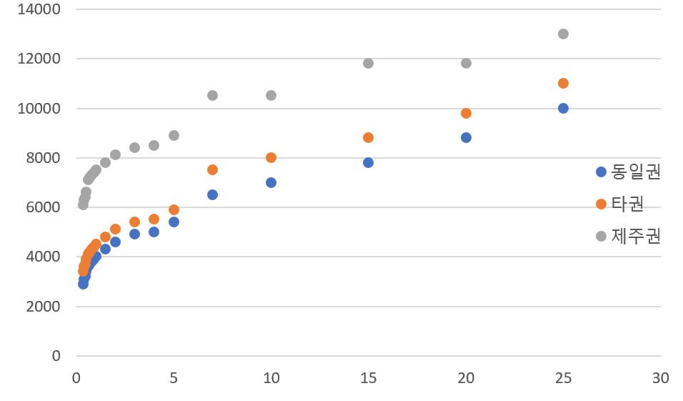

# 2022-02-14

## 과제1: 직육면체의 표면적과 그에 따른 가격 계산

> 가로, 세로, 높이가 각각 10cm, 20cm, 7cm인 직육면체가 있다.  
> 이 직육면체의 가격은 표면적에 따라 변하고 1m<sup>2</sup> 당 1000원이다.  
> 이 직육면체의 가격을 계산해 출력.

직육면체의 표면적은 6면의 면적합이다.  
가로, 세로, 높이를 각각` x, y, z`라고 했을 때, 면적이 `xy`인 면 두개, `yz`인 면 두개, `zx`인 면이 두개 있기 때문에 아래와 같이 계산할 수 있다.

```text
// 총 면적
int area = 2 * x * y + 2 * y * z + 2 * z * x;
```

하지만 `x, y, z`는 `cm`단위인데 면적당 가격은 원/`m`<sup>2<sup>이기 때문에 단위 환산을 포함해 다시 적으면

```text
// 총 면적
double area = 2 * x * y + 2 * y * z + 2 * z * x / 10000.0;
```

이 된다.  
여기서 10000으로 나눌때 소수점을 포함한 숫자가 될 가능성이 있어 `double`로 변경했다.  
또한 그냥 10000이라고 적으면 `int`끼리의 계산이 되기 때문에 10000.0이라고 적어 floating point number임을 명시했다.

완성된 코드는 다음과 같다.

```java
package org.zerock;

public class Cuboid {
    public static void main(String[] args) {
        System.out.println("이 프로그램은 직육면체의 가로, 세로, 높이(cm)와 면적(m^2)당 가격(원)에 따라 직육면체의 가격을 계산하는 프로그램 입니다.");

        // 직육면체의 가로, 세로, 높이(cm)
        int x = 10; // 가로 = 10cm
        int y = 20; // 세로 = 20cm
        int z = 7;  // 높이 = 7cm

        // 면적(m^2) 당 가겨(원)
        int pricePerSquareMeter = 1000; // 면적당가격 = 1000원/1m^2

        // 총 면적(6면의 면적합)
        double area = 2 * (x * y + y * z + z * x) / 10000.0; // 10000.0으로 나누기(cm^2 -> m^2)

        System.out.printf("(가로, 세로, 높이) = (%d, %d, %d)인 직육면체의 표면적은 %fm^2\n", x, y, z, area);
        System.out.printf("면적당 가격은 %d원/m^2 이므로\n", pricePerSquareMeter);
        System.out.printf("이 직육면체는 <<%f원>> 입니다.", area * pricePerSquareMeter);
    }
}

```

실행 결과

```bash
이 프로그램은 직육면체의 가로, 세로, 높이(cm)와 면적(m^2)당 가격(원)에 따라 직육면체의 가격을 계산하는 프로그램 입니다.
(가로, 세로, 높이) = (10, 20, 7)인 직육면체의 표면적은 0.082000m^2
면적당 가격은 1000원/m^2 이므로
이 직육면체는 <<82.000000원>> 입니다.
```

## 과제2: 시침과 분침이 이루는 각도 계산

> 사용자로부터 시각(시간, 분)을 입력받아 그 시각에 시침과 분침이 이루는 각도를 계산해 출력.

이 과제는 시침이 분침의 회전에 따라 같이 회전하는 것을 고려해야한다.

시침은 한시간(60분)에 30도, 즉 1분에 0.5도를 회전한다.  
분침은 5분에 30도, 즉 1분에 6도씩 회전한다.

시간을 hour, 분을 minute라고 하면 분침이 숫자12와 이루는 각도는 `m * 6`, 시침이 숫자 12와 이루는 각도는 `h * 30 + m * 0.5`이 된다.

위의 내용을 코드로 옮겨 아래와 같이 작성했다.

```java
package org.zerock;

import java.util.Scanner;

public class Clock {
    public static void main(String[] args) {
        Scanner scanner = new Scanner(System.in);

        System.out.println("이 프로그램은 시각(시간, 분)을 입력하면 시침과 분침 사이의 각도(degree)를 계산하는 프로그램 입니다.");

        System.out.print("시간(0~23): ");
        int hour = scanner.nextInt();
        System.out.print("분(0~59): ");
        int minute = scanner.nextInt();

        if (hour < 0 || hour > 23 || minute < 0 || minute > 59) {
            // 입력 받은 숫자가 유효하지 않은 경우
            // 유효 숫자 입력 방법 출력 후 종료
            System.out.println("시간은 0~23, 분은 0~59 의 범위 내의 숫자를 입력해주세요.");
        } else {
            // 시침과 분침이 12를 기준으로 시계방향으로 몇도 회전했는지 나타내는 변수
            double angMinute = minute * 6.0;
            double angHour = hour * 30.0 + minute * 0.5;
            if (angHour > 360) {
                // 만약 12~23시를 입력 받아 360도 이상의 값이 되었을 경우 360도 이하의 값으로 수정
                angHour = angHour - 360;
            }
            // 시침과 분침이 이루는 각도
            double ang = Math.abs(angHour - angMinute);
            if (ang > 180) { ang = Math.abs(ang - 360); } // 예각 표시로 전환
            // 결과 출력
            System.out.printf("%d시%d분에 시침과 분침이 이루는 각도는 %.2f도 입니다.", hour, minute, ang);
        }
    }
}
```

실행결과1

```bash
이 프로그램은 시각(시간, 분)을 입력하면 시침과 분침 사이의 각도(degree)를 계산하는 프로그램 입니다.
시간(0~23): >0
분(0~59): >30
0시30분에 시침과 분침이 이루는 각도는 165.00도 입니다.
```

실행결과2

```bash
이 프로그램은 시각(시간, 분)을 입력하면 시침과 분침 사이의 각도(degree)를 계산하는 프로그램 입니다.
시간(0~23): >0
분(0~59): >54
0시54분에 시침과 분침이 이루는 각도는 63.00도 입니다.
```

## 과제3: 택배 가격 안내

> [GSpostbox](https://www.cvsnet.co.kr/service/national-delivery/use/contentsid/205/index.do)홈페이지 최하단의 이용운임 안내를 바탕으로 택배의 중량과 배송 지역권에 따라 운임을 출력.  
> 중량과 배송 지역권은 사용자로부터 입력 받을 수 있게 했다.

중량과 운임간의 상관관계를 찾기 위해 일일히 엑셀에 입력해 그래프화 시켜봤지만 전체를 관통하는 명확한 함수를 찾기에는 조금 복잡해 보였다.


그래서 그냥 테이블 전체를 동일권, 타권, 제주권 세가지로 나눠서 배열 3개에 저장했다.  
그리고 각 배열내에서 몇번째 값이 어떤 중량에 해당하는지를 구분하기 위해 중량 배열도 따로 만들었다.

for문 안에서 중량 정보 배열을 탐색하면서 택배의 중량이 속한 중량 범위를 찾아내고 그 때의 index를 각 지역권 가격표 배열에 적용시키면 운임을 중량과 지역권에 따른 운임을 특정할 수 있다.

코드는 아래와 같이 작성했다.

```java
package org.zerock;

import java.util.Scanner;

public class Deliver {

    public static void main(String[] args) {
        Scanner scanner = new Scanner(System.in);
        System.out.print("택배 무게(g;gram): ");
        int weight = scanner.nextInt();
        System.out.print("배송 목적지 구분(1:동일권, 2:타권, 3:제주권): ");
        int deliverZone = scanner.nextInt();

        // 동일권, 타권, 제주권에서의 가격표.
        int[] pricesSameRegion = {
                2900, 3100, 3200, 3400, 3600,3700, 3800
                , 3900, 4000, 4300, 4600, 4900, 5000
                , 5400, 6500, 7000, 7800, 8800, 10000
        };
        int[] pricesDifferentRegion = {
                3400, 3600, 3700, 3900, 4100, 4200, 4300,
                4400, 4500, 4800, 5100, 5400, 5500, 5900,
                7500, 8000, 8800, 9800, 11000
        };
        int[] pricesJejuRegion = {
                6100, 6300, 6400, 6600, 7100, 7200, 7300,
                7400, 7500, 7800, 8100, 8400, 8500, 8900,
                10500, 10500, 11800, 11800, 13000
        };

        // 가격을 구분 무게 일람(g;gram)
        int[] weights = {
                0, 350, 400, 450, 500, 600, 700,
                800, 900, 1000, 1500, 2000, 3000, 4000,
                5000, 7000, 10000, 15000, 20000
        };

        int weightIndex = 0;
        for (int i = 0; i < weights.length; i++) {
            if (weight < weights[i]) {
                break;
            }
            weightIndex = i;
        }

        int price = 0;
        String region = "";
        switch (deliverZone) {
            case 1:
                price = pricesSameRegion[weightIndex];
                region = "동일권";
                break;
            case 2:
                price = pricesDifferentRegion[weightIndex];
                region = "타권";
                break;
            case 3:
                price = pricesJejuRegion[weightIndex];
                region = "제주권";
                break;
        }
        System.out.printf("%dg의 택배를 %s으로 보내는 비용은 %d원 입니다.",weight, region, price);
    }
}
```

실행 결과1

```bash
택배 무게(g;gram): 850
배송 목적지 구분(1:동일권, 2:타권, 3:제주권): 3
850g의 택배를 제주권으로 보내는 비용은 7400원 입니다.
```

실행 결과2

```bash
택배 무게(g;gram): 23000
배송 목적지 구분(1:동일권, 2:타권, 3:제주권): 2
23000g의 택배를 타권으로 보내는 비용은 11000원 입니다.
```

많은 경우를 시험해 보진 않았지만 6번 가량 시행 결과 [GSpostbox](https://www.cvsnet.co.kr/service/national-delivery/use/contentsid/205/index.do)의 내용과 일치했다.
